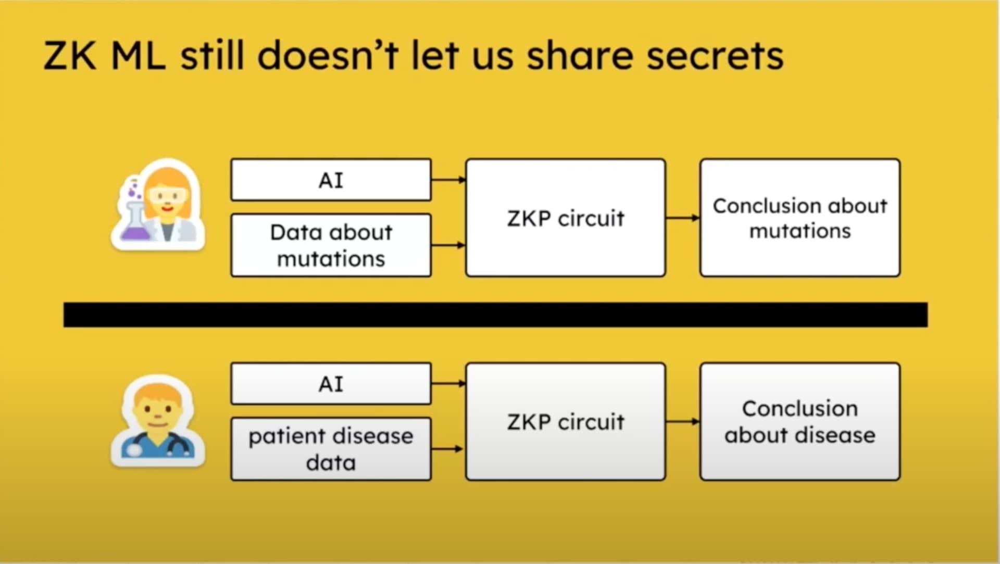
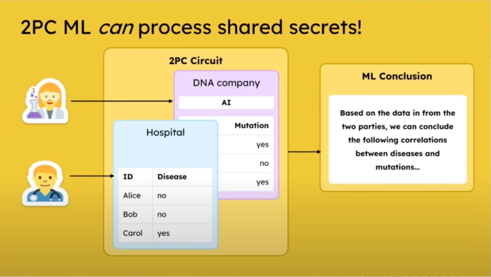

# Programmable MPC vs ZKP

By [Abo](https://quilibrium.discourse.group/u/abo/summary) - Source: [Quilibrium forum](https://quilibrium.discourse.group/t/programmable-mpc-vs-zkp/19)

***

One of the novelties of Quilibrium is that [it uses](https://paragraph.xyz/@quilibrium.com/eli5-quilibrium#h-elihs) programmable MPC (secure multi-party computation) to provide confidentiality on the network as opposed to programmable ZKP (zero-knowledge cryptography) used by most other networks. Programmable MPC has just become feasible recently and the field is approximately where ZKP was 5-6 years ago.

A special case of MPC is 2PC, that is, secure multi-party computation carried out between two parties. The [2PC is for Lovers](https://www.youtube.com/watch?v=PzcDqegGoKI) talk by Barry Whitehat at Devconnect 2023 is a great intro to programmable 2PC.

The TLDR is that ZKP lets us compute over single party secrets while MPC lets us compute over secrets from multiple parties. This is needed to implement stuff like Tinder swipes where you only match if both say yes. With ZKP there is a first mover problem where one party has to reveal their choice without knowing if the other matches.



<figure><figcaption></figcaption></figure>

<figure><figcaption></figcaption></figure>
