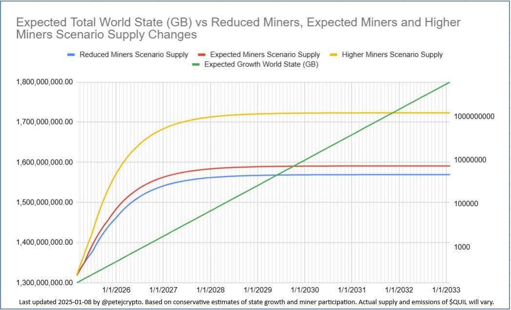

# Quilibrium tokenomics


For a detailed technical explanation please read this [article on Proof of Meaningful Work (PoMW)](https://paragraph.xyz/@quilibrium.com/proof-of-meaningful-work).


Quilibrium employs a **generational token issuance model** tied to the network’s computational progress, ensuring long-term sustainability and decentralization. Instead of a fixed emission schedule, rewards dynamically adjust based on network milestones.

$QUIL is a utility token designed for use within the Quilibrium network. It is not intended for speculation, investment, or financial gain. Quilibrium Inc. does not endorse or facilitate any trading activities related to $QUIL or $wQUIL.

$QUIL tokens can only be mined. There was no allocation to VCs, and no airdrops.

### Token emissions for the current generation


The current generation will last until 100 millions iterations are reached. This is roughly estimated to happen around 2033.


* Circulating Supply (10.02.25): \~ 1.3 Billions - please see the [dashboard](https://dashboard.quilibrium.com/) for the most updated value
* Inflation: 1.6 to 1.7 Billions in 2033 (estimation)
* Token emissions diminish according to network growth (storage demands)
* As the network grows and emissions flatten out in each generation, transaction fees play a bigger role in miner incentives. See also [gas-fees-and-dynamic-fee-market-on-quilibrium.md](gas-fees-and-dynamic-fee-market-on-quilibrium.md "mention")

<figure><figcaption>
<em>The above chart is a conservative estimation, based on comment from the development team. Actual emission rate will depend on network storage demands.</em>
</figcaption></figure>

***

### wQUIL token 

_$wQUIL is the official token bridged to Ethereum. It is safe to hold. $QUIL, is the original network token._

* Contract: [0x8143182a775c54578c8b7b3ef77982498866945d](https://etherscan.io/token/0x8143182a775c54578c8b7b3ef77982498866945d)
* [Coingecko](https://www.coingecko.com/en/coins/wrapped-quil) – [CoinMarketcap](https://coinmarketcap.com/currencies/wrapped-quil/#Markets)
* Buy on DEX: [Uniswap](https://app.uniswap.org/swap?inputCurrency=ETH\&outputCurrency=0x8143182a775c54578c8b7b3ef77982498866945d)
* Buy on CEX: [MEXC](https://www.mexc.com/exchange/WQUIL_USDT) – [Coinex ](https://www.coinex.com/en/exchange/wquil-usdt)– [Bitkonan](https://www.bitkonan.com/trade/view/wquil_usdt)
* Chart: [Dextools](https://www.dextools.io/app/en/ether/pair-explorer/0x43e7ade137b86798654d8e78c36d5a556a647224)

_Markets’ list may be outdated. Check on_ [_Coingecko_](https://www.coingecko.com/en/coins/wrapped-quil) _or_ [_CoinMarketcap_](https://coinmarketcap.com/currencies/wrapped-quil/#Markets) _the updated lists._

***

### Adaptive Emissions and Mining Incentives

Quilibrium’s token emissions adjust dynamically based on network-wide computational progress. Instead of following a fixed schedule, each new generation of $QUIL emissions is triggered when the network surpasses a predefined computational threshold, determined by the Verifiable Delay Function (VDF).

As mining hardware improves and software optimizations increase efficiency, the network’s difficulty gradually rises. Once it reaches the next generational milestone (e.g., 100 million iterations for Generation 2), emissions temporarily spike before tapering off again. This approach prevents a Bitcoin-like scenario where mining becomes dominated by those with the most advanced hardware. Instead, Quilibrium’s model ensures that both early and later participants remain incentivized, fostering long-term decentralization.

### Token Emissions for Future Generations

The network launched with \~10,000 iterations per \~10 seconds. As of 12.02.2025, iteration speed has increased to \~160,000, a 16x improvement, though exact timing depends on hardware capabilities. The next milestone—100 million iterations—is estimated to be reached around 2033, unlocking a new emissions curve. However, the timeline may vary based on computational advancements and miner participation.

**Generational Thresholds:**

* **Generation 1 (Current)**
* **Generation 2:** 100 million iterations → Estimated emissions reset in 2033
* **Generation 3:** 1 trillion iterations
* **Future Generations:** Growth follows an exponential scale (e.g., 10 quadrillion iterations, etc.).

Each generational reset creates a temporary increase in emissions before returning to a gradual decline, ensuring sustained miner incentives and network security.

What are "iterations" ?

An **iteration** in Quilibrium refers to a single step in the network’s **Verifiable Delay Function (VDF)**, which is a way to prove that time has passed.&#x20;

Since this function cannot be sped up by running multiple calculations in parallel, each iteration must be completed one after another, making it a reliable measure of computational progress.&#x20;

The faster the network can process these iterations, the more powerful the hardware running it has become. When the network reaches a set number of iterations, like **100 million**, it triggers a new generation of token emissions.&#x20;

Essentially, an iteration is a basic unit of work that helps secure the network and determines when new tokens are released.


To understand why this adaptive issuance model is important, please read [how-does-quilibrium-maintain-decentralization.md](how-does-quilibrium-maintain-decentralization.md "mention")


