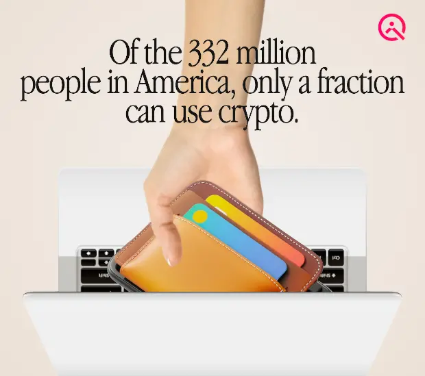

# The Alternative Thesis for Consumer Crypto


This article is a VERY SIMPLIFIED summary of a longer talk by Cassandra Heart (Quilibrium founder). See the video below to dive deeper into the topic.




### The Evolution of Computing and Its Parallel in Crypto

At Quilibrium, we believe that history doesn’t repeat, but it certainly rhymes. The evolution of computing offers a compelling parallel to the transformation happening in the crypto space today. Just as the personal computer revolution was driven by a relentless pursuit of making computing more accessible, we see a similar need to make blockchain technology more intuitive and usable for consumers.

<figure><figcaption></figcaption></figure>

### Learning from the Past: The Homebrew Computer Club and the Rise of Personal Computing

In 1975, the Homebrew Computer Club in California envisioned a future where microcomputers would become widely accessible. At the time, computers were bulky, expensive, and required deep technical expertise to operate. Yet, visionaries such as Steve Jobs and Steve Wozniak saw beyond these barriers and introduced the Apple I, followed by the Apple II. Their innovations, which blended user-friendly hardware with an elegant software experience, reshaped the industry.

IBM initially dismissed personal computers, believing them to be insignificant. However, by the early 1980s, it became clear that the consumer computing revolution was unstoppable. Apple’s commitment to usability and seamless hardware-software integration laid the foundation for modern personal computing, ultimately leading to the Macintosh in 1984—a device that truly transformed how people interacted with technology.

### The Blockchain Revolution and Its Bottlenecks

A similar trajectory has unfolded in the world of blockchain and crypto. Initially envisioned as a peer-to-peer cash system, Bitcoin laid the groundwork by introducing the concept of a decentralized ledger. Ethereum expanded on this with smart contracts, making programmable finance a reality. However, despite these advances, blockchain technology remains largely inaccessible to everyday users due to its complexity, high costs, and financial-centric focus.

Ethereum’s evolution, from its original proof-of-work model to its current proof-of-stake consensus with sharding and KZG blob commitments, mirrors the increasing complexity in early computing. Similarly, Solana’s parallel execution model introduces optimizations reminiscent of hyperthreading in CPUs. However, these solutions, while powerful, have yet to address the fundamental question: How do we make crypto truly consumer-friendly?

### Reimagining Crypto for Consumers: A New Approach

At Quilibrium, we believe that consumer crypto needs to follow the same path as personal computing—by simplifying interactions, abstracting complexities, and integrating seamlessly with user experiences. Here’s how we’re achieving that:

1. **Efficient Storage and Computation** – By leveraging KZG commitments, we enable vast data storage that is both compact and verifiable. This removes unnecessary bottlenecks and reduces costs.
2. **Single-Slot Finality** – Borrowing from cutting-edge cryptographic research, we’ve implemented single-slot finality, ensuring instant finalization of transactions without requiring excessive memory or historical data retention.
3. **Garbled Circuits for Privacy** – By incorporating garbled circuits into computation, we enhance user privacy at every level, ensuring that financial transactions and interactions remain secure.
4. **Hardware-Integrated Key Management** – Instead of requiring external wallets, we utilize hardware security modules (HSMs) present in modern devices to manage cryptographic keys, making authentication as simple as Face ID or Touch ID.
5. **Decentralized Computation with True Scalability** – Our architecture mimics the efficiency of modern processors, enabling massively parallelized execution without the trade-offs seen in existing networks.

### The Impact: A New Era for Crypto Applications

By taking these principles into account, we’re building a blockchain infrastructure that mirrors the consumer-oriented evolution of personal computing. Instead of forcing users to interact with cumbersome wallets and confusing gas fees, Quilibrium provides an experience that is intuitive, fast, and secure.

This unlocks new possibilities, including:

* **Truly serverless applications** that function independently of centralized service providers.
* **Seamless digital identity management** without the hassle of managing complex seed phrases.
* **Affordable and scalable data storage**, making it feasible to host and access large-scale applications directly on-chain.
* **Privacy-preserving transactions** that give users full control over their data and assets.

### The Future: Building Towards the Macintosh Moment of Crypto

Just as the Apple II and Macintosh revolutionized personal computing by prioritizing usability and integration, we believe Quilibrium is paving the way for the next generation of consumer crypto. By taking inspiration from computing history, we are designing a blockchain ecosystem that puts users first, simplifies interactions, and enables a richer, more secure digital experience.

The future of consumer crypto isn’t about making finance more complex—it’s about making digital interactions more seamless, private, and accessible. At Quilibrium, we’re committed to building that future.

